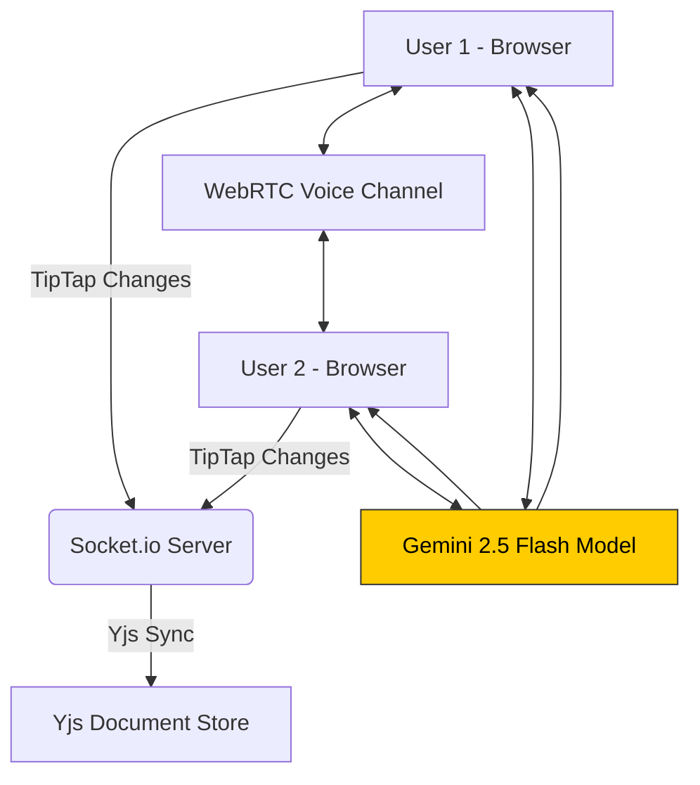

# 📝 Docex — Real-Time Collaborative Document Editor

Docex is a modern, production-oriented collaborative editor built for teams. It combines an opinionated rich-text editor with real-time synchronization, voice chat, and AI-assisted features so multiple users can author documents together while talking and iterating in real time.

Key technologies: TipTap, Yjs, Socket.IO, WebRTC (STUN/TURN), and an AI assistant integration.

---

## 🚀 Highlights

- Real-time collaborative editing with conflict-free synchronization (Yjs + Socket.IO)
- Integrated voice chat using WebRTC with TURN support for NAT traversal
- AI-assisted writing tools (Gemini integration)
- Room-based workflow — share Room IDs to join a session
- Lightweight UI built with React + Tailwind; fast local dev with Vite

---

## Features

- Live multi-user editing (TipTap + Yjs)
- Real-time presence and active user list
- Voice communication (WebRTC) with mute/unmute and remote audio
- Save/export document functionality
- AI helpers: generate, ask, and edit content via backend AI endpoints
- Production-ready deployment guidance for Vercel (frontend) and Render (backend)

---

## Quick start (local)

Prerequisites

- Node.js 18+ and npm or pnpm

Clone and run

```bash
git clone <repo-url>
cd Docex

# frontend
cd frontend
npm install
npm run dev

# open a second terminal for backend
cd ../backend
npm install
npm run start   # or npm run dev if available
```

Open the frontend URL (usually http://localhost:5173) and create or join a room to test collaboration and voice chat.

---

## Project layout

- frontend/ — React (Vite) client (TipTap + Yjs + WebRTC client)
- backend/ — Express + Socket.IO server, TURN credential proxy, AI endpoints

---

## 🏗️ Architecture Overview


